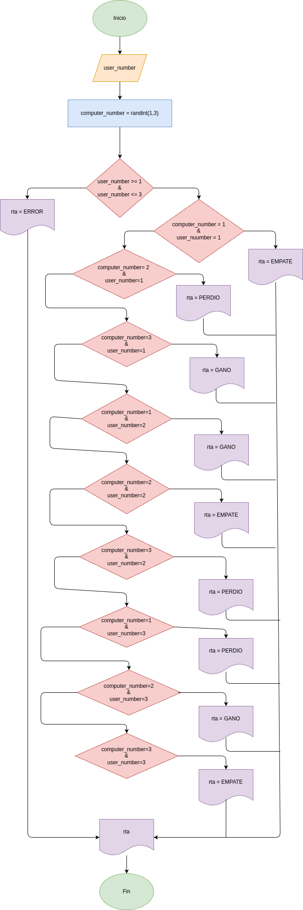

# piedra_papel_tijera
Programa en Python para jugar al juego piedra papel o tijera

## Análisis

### Variable de entrada
- user_number: número del usuario

### Processamiento
- user_numbre >=1 and user_number <=3
- computer_number > user_number
- computer_number < user_number
- computeer_number = user_number

### Variable de salida
- rta

## Diseño

## Construcción
- codigo implementado en el archivo piedra_papel_tijera.py
